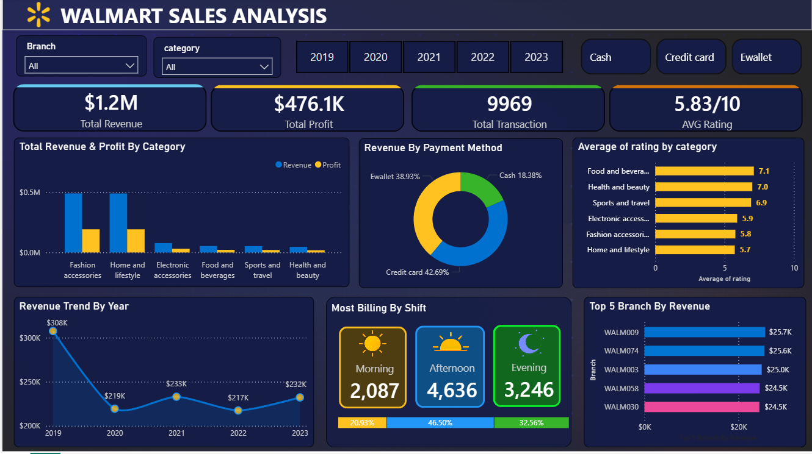

<div align="center">

# Walmart Sales Analysis
### End-to-End Business Intelligence · Python · SQL · Power BI

</div>

---

## Business Problem

Across 100 Walmart branches and 6 product categories, revenue dropped 29% after 2019 and never recovered. This project investigates why — using 9,969 transactions across 5 years — and identifies the specific decisions that cost the business an estimated **$82,000 per year for 4 consecutive years**.

---

## Dashboard



> 📥 [View Full Presentation (PDF)](Walmart_Sales_Analysis_presentation.pdf)  
> 🖼️ [View Dashboard Screenshot (PNG)](Walmart_Dashboard.png)  
> 📊 [Open Power BI Dashboard (.pbix)](Walmart_Sales_Dashboard.pbix)

---

## Project Metrics

| Metric | Value |
|---|---|
| Total Revenue Analysed | $1,209,726 |
| Total Profit | $476,100 |
| Total Transactions | 9,969 |
| Branches | 100 |
| Product Categories | 6 |
| Date Range | Jan 2019 – Dec 2023 |
| Avg Customer Rating | 5.83 / 10 |
| 2019 Revenue (Peak) | $307,587 |
| Post-2019 Annual Avg | $225,535 |
| Annual Revenue Gap | −$82,052 |

---

## Key Findings

### 1. Three High-Rated Categories Were Discontinued — With No Financial Justification

After 2019, three categories vanished entirely from the sales data: **Food & Beverages** (7.1/10), **Health & Beauty** (7.0/10), and **Sports & Travel** (6.9/10). These were the three highest-rated categories in the dataset.

The critical finding: all six categories operated at **identical ~39–40% profit margins**. There is no margin-based explanation for removing them. The business discontinued its best-performing products by customer satisfaction and retained its lowest-rated ones.

| Category | 2019 Revenue | Profit Margin | Avg Rating | Post-2019 |
|---|---|---|---|---|
| Food & Beverages | $53,500 | ~40% | 7.1 / 10 | Zero |
| Health & Beauty | $46,900 | ~40% | 7.0 / 10 | Zero |
| Sports & Travel | $52,500 | ~39% | 6.9 / 10 | Zero |
| Fashion Accessories | $489,500 | ~39% | 5.8 / 10 | Active |
| Home & Lifestyle | $489,300 | ~39% | 5.7 / 10 | Active |
| Electronic Accessories | $78,200* | ~39% | 5.9 / 10 | Collapsed |

*\* 87% of Electronics revenue came from 2019 alone. See Finding 2.*

---

### 2. Electronic Accessories: 87% Revenue Collapse — A Zombie Category

Electronics is technically present across all 5 years but generated just **$6,500/year on average after 2019**, down from $52,000 in 2019 — an 87% collapse with no recovery.

What makes it worse: Electronics customers pay by **credit card at 59.9%** — the highest rate of any category. The category with the least revenue carries the highest payment processing cost.

The real picture is not "3 remaining categories" as it appears on paper. It is **2 categories carrying the business**, 1 that is functionally inactive, and 3 that were eliminated.

---

### 3. 80.9% Revenue Concentration Risk

**Fashion Accessories ($489,500) and Home & Lifestyle ($489,300) account for 80.9% of all revenue** across the 5-year period. Any supply disruption, demand shift, or competitive pressure in either category directly threatens the entire business. This is not a growth problem — it is a structural risk.

---

### 4. Credit Card Dominance Is Costing Margin

| Payment Method | Transaction Share | Volume |
|---|---|---|
| Credit Card | 42.7% | ~4,248 transactions |
| Ewallet | 38.9% | ~3,878 transactions |
| Cash | 18.4% | ~1,834 transactions |

Nearly 43% of all transactions run through the highest-cost payment channel. Merchant processing fees on the credit card volume represent avoidable annual cost. A 1–2% Ewallet incentive — discount or loyalty points — would shift volume toward the lower-cost channel with no product changes required.

---

### 5. Morning Shift Is Structurally Underutilised

| Shift | Transactions | Share |
|---|---|---|
| Morning (6–11am) | 2,087 | 20.9% |
| Afternoon (12–6pm) | 4,636 | 46.5% |
| Evening (7–11pm) | 3,246 | 32.6% |

Morning runs for **6 hours but generates less than half the transactions of the evening shift**, which operates in a shorter window. A time-limited morning discount or loyalty multiplier is the lowest-effort revenue lever available.

---

## Recommendations

| Priority | Action | Expected Impact | Effort |
|---|---|---|---|
| P1 | Reinstate Food & Beverages — pilot across 10 branches | High | Medium |
| P2 | Reintroduce Health & Beauty and Sports & Travel | High | Medium |
| P3 | Ewallet incentive — 1–2% discount or loyalty points | Medium | Low |
| P4 | Morning revenue drive — time-limited offer before 11am | Medium | Low |
| P5 | Formally decide on Electronics — invest or discontinue | Low | Low |

**P1 and P2 address the same root cause.** Fixing the discontinuation automatically reduces the concentration risk. Food & Beverages is the strongest pilot candidate: highest rating (7.1/10), 40% margin, $53,500 revenue from just 174 transactions in 2019.

---

## Tools & Technologies

| Tool | Purpose |
|---|---|
| Python (Pandas, NumPy, Matplotlib, Seaborn) | Data cleaning, EDA, trend analysis, margin calculations |
| PostgreSQL | Window functions, CTEs, YoY analysis, shift segmentation |
| Power BI (DAX, Power Query) | Interactive dashboard with drill-through by year, category, branch, payment |

---

## SQL — Query Coverage

10 business queries covering window functions, CTEs, date parsing, and aggregations.

```sql
-- Q9: Top 5 branches with steepest YoY revenue decline
WITH revenue_2022 AS (
    SELECT branch, SUM(total_price) AS revenue
    FROM walmart
    WHERE EXTRACT(YEAR FROM TO_DATE(date, 'DD/MM/YY')) = 2022
    GROUP BY branch
),
revenue_2023 AS (
    SELECT branch, SUM(total_price) AS revenue
    FROM walmart
    WHERE EXTRACT(YEAR FROM TO_DATE(date, 'DD/MM/YY')) = 2023
    GROUP BY branch
)
SELECT
    ls.branch,
    ls.revenue                                          AS last_year_revenue,
    cs.revenue                                          AS current_year_revenue,
    ROUND((ls.revenue - cs.revenue)::numeric /
           ls.revenue::numeric * 100, 2)               AS decline_pct
FROM revenue_2022 ls
JOIN revenue_2023 cs ON ls.branch = cs.branch
WHERE ls.revenue > cs.revenue
ORDER BY decline_pct DESC
LIMIT 5;
```

| # | Business Question |
|---|---|
| Q1 | Payment method distribution and transaction counts |
| Q2 | Highest-rated category per branch (RANK window function) |
| Q3 | Busiest day per branch (RANK + date parsing) |
| Q4 | Total quantity sold per payment method |
| Q5 | Rating statistics — avg, min, max — per city and category |
| Q6 | Total profit per category (`unit_price × quantity × margin`) |
| Q7 | Dominant payment method per branch (RANK window function) |
| Q8 | Shift segmentation — Morning / Afternoon / Evening by branch |
| Q9 | Top 5 branches by YoY revenue decline (CTE + JOIN) |
| Q10 | Annual revenue and transaction trend |

---

## Repository Structure

```
walmart-sales-analysis/
│
├── clean_walmart.csv                        # Cleaned dataset — 9,969 records
├── Walmart_project.ipynb                    # Python EDA notebook
├── SQL_Walmart.sql                          # 10 business queries with commentary
├── Walmart_Sales_Dashboard.pbix             # Power BI dashboard
├── Walmart_Dashboard.png                    # Dashboard screenshot
├── Walmart_Sales_Analysis_presentation.pdf  # Presentation deck
└── README.md
```

---

## How to Run

**Python**
```bash
pip install pandas numpy matplotlib seaborn jupyter
jupyter notebook Walmart_project.ipynb
```

**SQL**
```bash
# Import data
psql -U your_user -d your_db \
  -c "\copy walmart FROM 'clean_walmart.csv' CSV HEADER"

# Run queries
psql -U your_user -d your_db -f SQL_Walmart.sql
```

**Power BI**
```
Open Walmart_Sales_Dashboard.pbix in Power BI Desktop.
Data loads automatically from the CSV — update the source path
in Power Query if needed.
```

---

## Data Source

Dataset sourced from [Kaggle — Walmart Sales Dataset](https://www.kaggle.com). Contains anonymised transaction records across 100 branches, 6 product categories, and 3 payment methods from January 2019 to December 2023.

---

## Author

**Kabeer Khan** — Data Analyst

[](mailto:kabeerk992@gmail.com)
[](https://www.linkedin.com/in/kabeer-khan-analyst)
[](https://github.com/kabeerK992)
